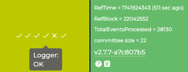

# Node using AWS CLI

## Solution 1. Restart your AWS EC2

This solution tries simple server restarting.

* Please get logged in AWS console

### Instructions

1. open [https://aws.amazon.com/](https://aws.amazon.com/) and log in with your guardian's account.
2. Please make sure right region is selected where your node is installed. (Region info is on the right top)
3.  Go to EC2 service menu.

    <figure><figcaption></figcaption></figure>
4.  Select Instances(running)

    <figure><figcaption></figcaption></figure>
5.  Select checkbox of current instance and try reboot instance.

    <figure><figcaption></figcaption></figure>
6. Please wait rebooting and check [status page](https://status.orbs.network/) after 30-60 mins. If your node is still offline, try the next solution.

***

## Solution 2. Re-install Node

This solution tries simple server restarting.

* Please get logged in your local machine which you used when install node previously (Mac or linux terminal)

### Instructions

1. Open "Terminal"
2. change directory to folder where "`orbs-node.json`" file located.(ie. `cd orbs-node`)
3.  `ls` command will show you files in current directory. Please make sure there is `orbs-node.json` file.

    <div align="left"><figure><figcaption></figcaption></figure></div>
4.  update polygon CLI to the latest one

    ```
    npm update -g @orbs-network/polygon
    ```
5.  Destory node using command below.

    ```
    polygon destroy -f orbs-node.json
    ```
6. Please wait until success massage displayed.
7.  When destroy command success, try create node again with command below. \
    (`pkey.txt` is and example. If you have another name or different way to refer private key of node address, use proper command)

    ```
    polygon create -f orbs-node.json --orbs-private-key $(cat pkey.txt)
    ```
8. Please wait until success massage displayed.
9.  Please wait and hour and check [status page](https://status.orbs.network/).  It can take 24 hours having all green.<br>

    <div align="left"><figure><figcaption></figcaption></figure></div>
10. If it keeps offline,  please contact [eddy@orbs.com](mailto:eddy@orbs.com).


