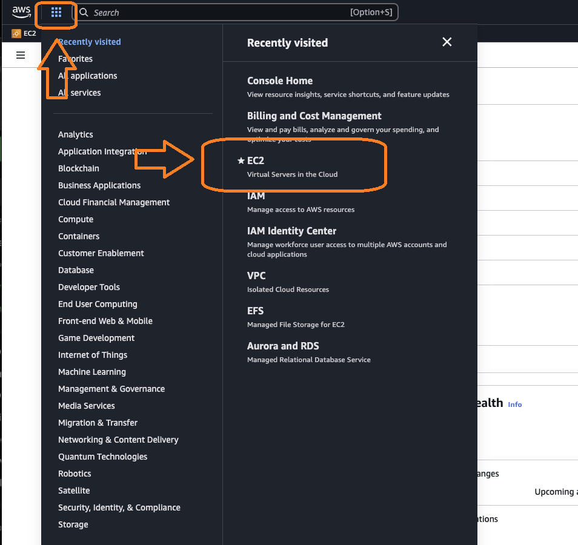

# AWS CLI로 설치한 경우

## 방법1. AWS EC2 재시작

이 방법은 AWS의 EC2 서버를 단순히 재부팅 시도하는 방법입니다.&#x20;

* 준비물: AWS console 로그인

### 방법 순서

1. [https://aws.amazon.com/](https://aws.amazon.com/) 에 접속하여 가디언의 AWS 계정으로 로그인합니다.
2. 처음 노드를 설치한 AWS Region이 선택되어 있는지 확인. (지역 선택은 우측 상단에 있습니다)
3.  EC2 서비스 메뉴로 이동하세요.

    <figure><figcaption></figcaption></figure>
4.  Instance(인스턴스) 목록을 선택하세요.

    <figure><figcaption></figcaption></figure>
5.  노드의 Instance(인스턴스)를 앞쪽 체크박스를 선택하고, "인스턴스 상태", "인스턴스 재부팅"을 순서대로 클릭해서 EC2 서버를 재시작(재부팅) 시킵니다.<br>

    <figure><figcaption></figcaption></figure>
6. 약 30\~60분 후,  [https://status.orbs.network/](https://status.orbs.network/) 에서 본인의 서버가 offline이 아닌, 정상적인 체크박스로 나타나는지 확인해보세요.
7. 만일 계속 offline이라면 아래 방법2를 수행해보세요.

***

## 방법2. Node 재설치

이 방법은 노드를 다시 재설치하는 방법입니다.&#x20;

* 준비물: 처음 노드를 설치할때 사용한 컴퓨터 환경 (맥북 또는 리눅스 OS 그대로)

### 방법 순서

1. 컴퓨터의 터미널  앱을 실행하세요.
2. orbs-node.json 파일이 있는 디렉토리로 이동하세요. (예. cd orbs-node) 디렉토리명은 다를 수 있습니다.
3.  ls 명령을 입력하여 해당 디렉토리에 orbs-node.json 파일이 있는지 확인하세요.

    <div align="left"><figure><figcaption></figcaption></figure></div>
4.  polygon 명령어를 최신버전으로 업데이트 합니다.

    ```bash
    npm update -g @orbs-network/polygon
    ```
5.  재설치를 하기 전에 아래 명령을 입력해서 설치된 노드를 먼저 제거해주세요.

    ```bash
    polygon destroy -f orbs-node.json
    ```
6. success 메세지가 나올 때까지 기다려주세요.
7.  위 명령이 성공적으로 마치면 (Success 메세지) 아래 명령을 입력해서 노드를 다시 설치해주세요.\
    (아래에서 pkey.txt 는 가디언마다 프라이빗키를 저장한 실제 파일명으로 수정해서 입력해주세요)

    ```bash
    polygon create -f orbs-node.json --orbs-private-key $(cat pkey.txt)
    ```
8. 성공적인 완료메세지(Success 메세지)가 나올때까지 기다려주세요.
9.  약 30\~60분 후,  [https://status.orbs.network/](https://status.orbs.network/) 에서 본인의 서버가 offline이 아닌, 정상적인 체크박스로 나타나는지 확인해보세요. (모든 칸이 초록색이되는데는 하루정도 걸릴 수 있습니다. 맨앞 칸이라도 체크박스가 되면 정상동작을 시작하고 있음을 뜻합니다)<br>

    <div align="left"><figure><figcaption></figcaption></figure></div>
10. 만일 destroy에 실패한다면, 아래 방법3을 시도해보세요.

## 방법3. AWS cleanup

1.  터미널에 아래 명령을 입력해서 polygon-cleanup을 내려받으세요.

    ```
    git clone https://github.com/orbs-network/polygon-cleanup.git
    ```

    만일 git 이 없어서 수행이 되지 않는다면 직접 코드를 아래 링크에서 다운로드 받고 압축을 푸세요.\
    [https://github.com/orbs-network/polygon-cleanup/archive/refs/heads/master.zip](https://github.com/orbs-network/polygon-cleanup/archive/refs/heads/master.zip)
2.  새로 생긴 (또는 압축을 해제한) polygon-cleanup 이라는 디렉토리로 이동하세요

    ```bash
    cd polygon-cleanup
    ```
3.  아래 명령으로 필요한 라이브러리를 설치하세요.\
    To set up the necessary dependencies for a Node.js project, run the following command in your terminal:

    ```bash
    npm install
    ```

    This will install all the packages listed in your `package.json` file.
4.  아래 명령으로 polygon-cleanup 을 생성합니다.

    ```bash
    npm link
    ```
5.  아래 명령으로 삭제 동작을 수행합니다. \
    &#x20;`--region` 뒤에는 자신이 노드가 설치된 지역을 적어주세요.(한국의 경우 "`ap-northeast-2`" 입니다)\
    &#x20;"MYNODE"부분은 orbs-node.json 파일에서 맨위에 입력했던 "name" 항목에 해당하는 값을 넣어주세요.

    ```bash
    polygon-cleanup all --region us-east-1 --profile default -q MYNODE-NAME
    ```

    예) polygon-cleanup all --region ap-northeast-2 --profile default -q my-node-name
6. 다시 orbs-node.json 파일이 있는 곳으로 돌아가서 polygon create 명령어로 재설치를 시도해보세요.
7. 만일 계속 실패한다면 , eddy@orbs.com 으로 도움을 요청하세요.

