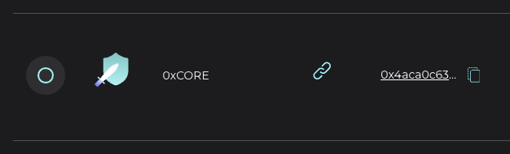

# 가디언 변경

위임자는 토큰을 언스테이크하지 않고도 위임 중인 가디언을 쉽게 바꿀 수 있습니다.

## TETRA - 데스크톱

가디언 이름 앞의 체크박스를 눌러 가디언을 변경하고 트랜잭션을 확인합니다.

<figure><figcaption>
체크박스를 눌러 가디언을 변경하세요
</figcaption></figure>

## TETRA - 모바일

상세 정보에서 "SELECT GUARDIAN" 버튼을 누르고 트랜잭션을 확인합니다.

<figure><figcaption></figcaption></figure>

