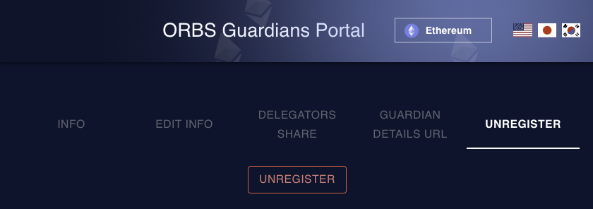

# 노드 운영 종료

## 자산 회수

### 스테이킹한 ORBS 언스테이크

등록 해제된 가디언은 더 이상 스테이킹 보상을 받지 않습니다. ORBS 언스테이크 및 출금이 필요합니다. 등록 해제 후 자산을 언스테이크할 수 있습니다.

### 입금한 ETH/POL 인출

노드 주소에서 ETH를 전송할 수 있습니다. 노드가 폴리곤 네트워크에 있는 경우 노드 주소의 POL도 확인하세요.

## 가디언 등록 해제

네트워크에서 등록을 해제하려면 [ORBS 가디언 포털](https://guardians.orbs.network/registration)로 이동합니다(Metamask 연결 필요).

1. Chrome 브라우저에서 [가디언 포털](https://guardians.orbs.network/)을 엽니다.
2. Metamask(가디언 지갑)를 연결하고 UNREGISTER 절차를 진행합니다.

<figure><figcaption></figcaption></figure>

⚠︎ 참고:

* 폴리곤 네트워크에도 등록한 경우, 네트워크를 폴리곤으로 바꾼 뒤 등록 해제 절차를 반복하세요.
* 컨트랙트를 직접 실행하려면 [이 컨트랙트 함수](https://etherscan.io/address/0xce97f8c79228c53b8b9ad86800a493d1e7e5d1e3#writeContract#F13)를 실행하세요.

## 배포된 서비스 제거

### AWS CLI 사용한 경우

1. 원격 PC에서 터미널을 열고 `orbs-node.json` 파일이 있는 디렉터리로 이동합니다.
2. polygon destroy 명령을 실행합니다.

```
polygon destroy -f orbs-node.json
```

3. AWS 콘솔에서 "Elastic IP"를 해제합니다.

원격으로 노드 삭제에 실패하면 AWS 콘솔에서 직접 EC2 인스턴스를 종료할 수 있습니다.

### AWS 스택 사용한 경우 <a href="#node-using-aws-marketplace" id="node-using-aws-marketplace"></a>

1. [AWS console](https://console.aws.amazon.com/console/home/?nc2=h_si\&src=header-signin) 로그인
2. `CloudFormation` 서비스 이동
3. `Stacks(스택)` 목록에서 설치된 노드 선택
4. `Delete stack(스택 삭제)` 버튼 클릭하고 삭제 진행


재설치를 하기 위해 삭제하는 경우 EIP를 따로 할당받아두는 것이 편리합니다. 그렇지 않으면 매번 삭제/재설치마다 새로운 IP가 할당이되어 가디언 등록 정보를 추가로 수정해주어야 합니다.


### 자체 서버를 운영하는 경우

Boyar 프로세스를 종료합니다.

## 노드가 올바르게 제거되었는지 확인

모든 서비스가 연결되지 않은 상태인지 확인합니다.

```
http://<node ip>
```

[노드 상태 목록](https://status.orbs.network/)에서 해당 노드가 사라졌는지 확인합니다.
